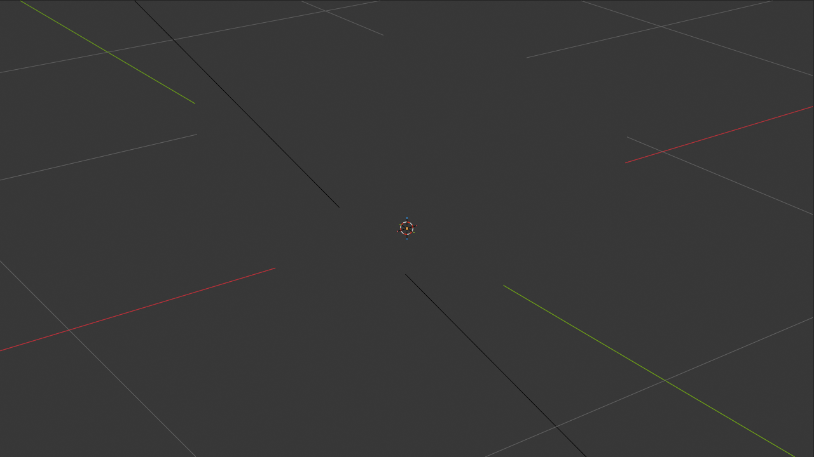

# Session 001 — 2026-05-01

## Goal
Setup completo de la estructura `blender/` en el repo + primera pieza prototipo
con icono **chart-bars embossed real** (no decal 2D) para validar el pipeline
end-to-end Blender → GLB → R3F antes de modelar las 7 variantes restantes.

## Starting point
- .blend: ninguno (default Untitled, solo el cubo de arranque de Blender)
- Repo: `kinetiba-hero-3d` con cubo Rubik 3×3×3 funcional usando decals Canvas2D
- Frames de referencia D2C revisados: 010, 075, 165, 180

## What was done

### Setup estructural
1. Creado `blender/` en raíz del repo con: `sessions/`, `_versions/`, `refs/`, `exports/`
2. Escrito `_TEMPLATE.md` para session logs futuros
3. Escrito `PROJECT-STATUS.md` inicial con contexto, decisiones y plan de sesiones
4. Copiados 4 frames clave de D2C a `blender/refs/` (010, 075, 165, 180) para tenerlos versionados al lado del .blend

### .blend setup
5. Engine: Cycles (GPU). View transform: AgX. World: sage `#879186` strength 0.5
6. Collections jerárquicas:
   - `_CUBE` → `Pieces`, `Anim_Empties`
   - `_BAKE_SETUP` → `HighPoly_Variants`, `LowPoly_Variants`
   - `_MATERIALS_LIBRARY`, `_REFERENCE`
7. Addons verificados: `io_scene_gltf2`, `node_wrangler` (ambos enabled)
8. Three-point lighting: Key (top-right area light, 500W), Fill (left, 150W), Rim (back, 200W)
9. Camera_Preview con TrackTo constraint apuntando al objeto activo

### Pieza prototipo: CubePiece_ChartBars
10. Cubo base 0.85 con bevel modifier (width 0.04, 3 segments, profile 0.7) y auto-smooth 30°
11. 4 barras chart embossed en cara +Y:
    - Heights: 0.20, 0.35, 0.50, 0.28 unidades
    - Width: 0.08 cada una, gap 0.04, protrusión 0.025 hacia afuera
    - Cada barra con bevel suave (0.008/2seg) en topes
12. Modifiers aplicados, todo joined en un solo objeto
13. Mesh final: 320 verts / 314 faces / ~620 tris

### Material `M_CubePiece_Cream`
14. Principled BSDF: base color cream `#E8E4D8` (sRGB→linear), roughness 0.55, IOR 1.45
15. Speckled procedural: Noise scale 250 + ColorRamp constant interpolation → manchas pequeñas darker_cream `#C8C2B5`. Mix factor 0.7 con base cream.
16. Bump sutil: Noise scale 80 + Bump strength 0.05, distance 0.02 → micro-textura en superficie
17. Total nodos: 9 (TexCoord, Mapping, 2× Noise, ColorRamp, Mix, Bump, Principled, Output)

### Export y entrega
18. Checkpoint v01_setup guardado en `_versions/`
19. Checkpoint v02_prototype_piece guardado en `_versions/`
20. Working file actual: `blender/kinetiba-hero-3d.blend`
21. GLB exportado: `blender/exports/cube_piece_prototype.glb` (24,292 bytes)
    - export_yup=True (Three.js convention), export_apply=True, sin cámaras ni luces
22. GLB copiado a `public/models/cube_piece_prototype.glb`
23. Viewport render OpenGL 1280×720 a `blender/refs/session_001_viewport.png`

## Decisions taken (additional to PROJECT-STATUS)
- **Iconos como geometría real, no normal-map baked en v01.** El bake llega en una sesión posterior solo si el GLB resulta muy pesado al escalar a 8 variantes. Con 24 KB para 1 pieza, las 8 variantes pesarían ~200 KB — totalmente aceptable, posiblemente nunca necesitemos bakear.
- **Material único cream + speckled, sin edge color tints.** Los tints coloreados (verde/púrpura/azul/naranja) que menciona MASTER_PLAN sección 1.4 entran en Session 006 como pulido. Para v01 mantenemos cohesión visual D2C-pure.
- **Cara +Y es el "frente" semántico** que lleva el icono. R3F probablemente necesitará rotar pieza para que el icono mire hacia afuera del cubo según su posición en el grid 3×3×3.

## Files touched
- `blender/PROJECT-STATUS.md`
- `blender/sessions/_TEMPLATE.md`
- `blender/sessions/session_001_2026-05-01.md`
- `blender/refs/frame_010.jpg`, `frame_075.jpg`, `frame_165.jpg`, `frame_180.jpg`
- `blender/refs/session_001_viewport.png`
- `blender/_versions/kinetiba-hero-3d_v01_setup.blend`
- `blender/_versions/kinetiba-hero-3d_v02_prototype_piece.blend`
- `blender/kinetiba-hero-3d.blend`
- `blender/exports/cube_piece_prototype.glb`
- `public/models/cube_piece_prototype.glb`

## Verification
- Viewport render OpenGL: las 4 barras chart visibles y embossed en cara +Y, bevels nítidos en aristas, material cream con tint de Key light, sombras direccionales correctas.
- GLB válido (export sin errores, draco compression library disponible y usada).
- Stats: 320 verts × 27 instancias = 8,640 verts totales para el cubo armado. Trivial para R3F.

## Lo que NO se hizo (intencional, fuera de scope de Session 001)
- **Integración React no se tocó.** Ese cambio lo hace Alfred manualmente cuando quiera ver la pieza en `npm run dev` (instrucciones abajo).
- Las otras 7 variantes de iconos (chat, invoice, bolt, + 4 abstractos) — Session 002.
- Animaciones (idle_rotation, face_solve, unfold, scatter, pill_morph) — Sessions 003-004.
- Edge color tints, contact shadows polish — Session 006.
- Bake a normal/AO atlas — pendiente, posiblemente innecesario.

## Open issues / next session
1. **Validar visualmente en navegador.** Cargar `cube_piece_prototype.glb` en R3F como reemplazo de **una sola** pieza del cubo (no las 27) para comparar lado a lado: pieza-vieja-con-decal vs pieza-nueva-con-icono-real. Si la nueva se ve mejor → procedemos con Session 002. Si igual o peor → debug iluminación/material antes de modelar las otras 7.
2. **Decisión de R3F:** ¿la pieza nueva conserva el material PBR del GLB o se reemplaza con uno custom de R3F? Si se reemplaza, todo el material PBR de Blender es decorativo y solo la geometría importa. Si se conserva, R3F debe tener envMap/HDRI cargado para que el cream cobre vida.
3. **Rotación por posición:** las 27 piezas necesitan que la cara con icono mire hacia afuera del cubo según `[gx, gy, gz]`. Esto se hace en JS al instanciar.

## Cómo integrar para validar (instrucciones para Alfred)

En el código actual donde cargas `cube_piece.glb` (probablemente en
`src/KinetibaHero/scene/CubePiece.jsx` o similar):

```jsx
// Antes:
const { scene } = useGLTF("/models/cube_piece.glb");

// Para test A/B, cargar AMBOS:
const oldPiece = useGLTF("/models/cube_piece.glb");
const newPiece = useGLTF("/models/cube_piece_prototype.glb");

// Y en el componente que renderiza la pieza, condicionalmente usar uno u otro
// (ej. solo la pieza [0,0,0] usa la nueva, el resto la vieja)
```

Levantar `npm run dev` → comparar la pieza nueva vs las 26 viejas. Reportar
hallazgos en Session 002 antes de empezar a modelar variantes.

## Screenshots

