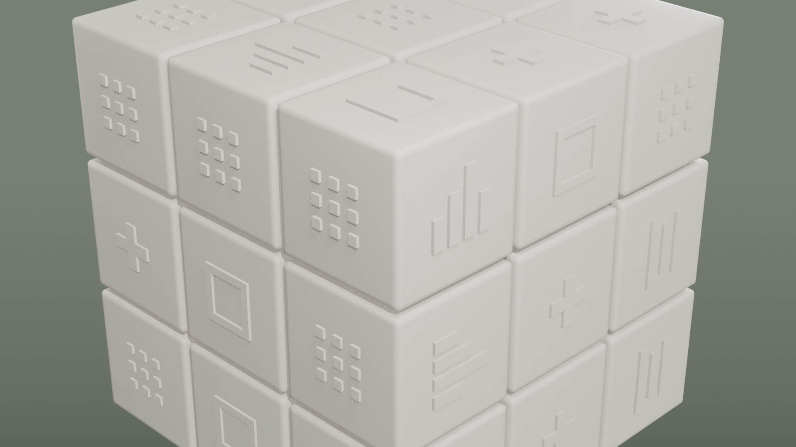
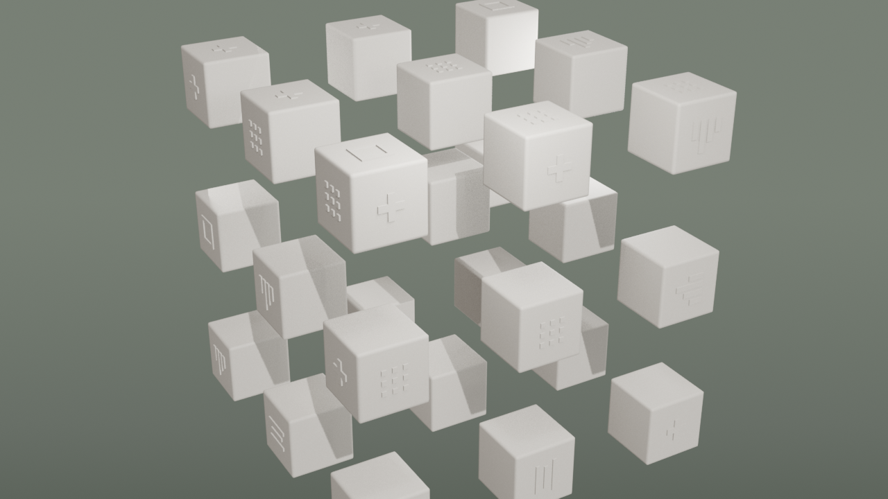
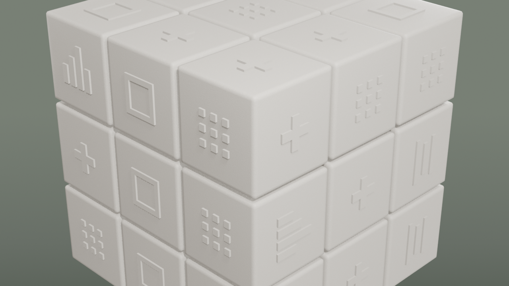

# Session 002 — 2026-05-01

## Goal
Cubo Rubik 3×3×3 completo, lookdev D2C-aligned, con animaciones base (idle + scatter)
exportadas en GLB para scroll-scrub en R3F. Iteración con screenshot tras cada cambio
mayor para validación visual.

## Starting point
- v02_prototype_piece.blend: una sola pieza con icono ChartBars
- Decisión: descartar el approach de "geometría real por icono modelado a mano" — quedaba
  imposible escalar a 8 variantes × 3-6 caras × 27 cubies
- Pivote: 27 cubies con MESH compartida + iconos paramétricos como geometría real distribuidos procedural

## What was done

### Step A — Assembly 27 cubies
1. Reset escena, borrado todo objeto mesh/empty (lights y cámara conservados)
2. Creado `_BaseCubie_Template` (cubo 0.85 con bevel 0.04/3seg/profile 0.7, auto-smooth 30°)
   con material `M_CubePiece_Cream` (Principled BSDF + Noise speckle 250 + Bump scale 80)
3. Instanciados 27 cubies compartiendo `M_BaseCubie` mesh (28 users del mesh data)
4. Spacing CELL = PIECE_SIZE + GAP = 0.85 + 0.04 = 0.89
5. Master Empty creado en (0,0,0) en collection `_CUBE`, parent de todos los cubies

### Step B — Iconos procedural en caras externas
6. Definidos 5 tipos de icono via función `build_icon_from_rects(name, rects)`:
   - **ChartBars** — 4 barras verticales heights 0.18/0.28/0.40/0.22
   - **DotsGrid** — 3×3 puntos de 0.06 spacing 0.13
   - **PlusCross** — cruz centrada arm 0.30 × 0.08
   - **HBars** — 3 barras horizontales widths 0.40/0.32/0.45
   - **SquareFrame** — marco cuadrado outer 0.36 thick 0.05
7. Para cada cubie en grid 3×3×3, determinadas caras outward (corners=3, edges=2, centers=1)
8. Por cada cara outward, creado objeto Icon parentado al cubie con local position/rotation
9. Distribución determinística por seed `hash((gx,gy,gz,face_label))`
10. Total: 54 iconos sobre 9+12+6=27 caras-9-cells × 6 faces = 54 outer face cells
11. Bug encontrado y arreglado: usar `matrix_parent_inverse = parent.world_matrix.inverted()`
    cancelaba la herencia y todos los iconos quedaban en world-origin. Solución: skip
    matrix_parent_inverse, usar location/rotation como local-to-parent (default).

### Step C — Lighting con HDRI + sage gradient background
12. Cargado `studio_small_09_1k.hdr` del propio repo (`public/hdri/`) como environment
13. World shader hybrid: HDRI para lighting (rays no-camera) + sage gradient para camera rays.
    Light Path node separa is_camera_ray y mixea entre dos Background nodes.
14. Sage gradient con 3 stops (sage_top `#9aa697`, sage_mid `#879186`, sage_bottom `#535f52`)
    mapeado a Window-coord Y (screen-space vertical). Resultado: D2C-like.
15. Three-point lighting ajustado: Key 350W, Fill 80W, Rim 300W (Rim alto para separar cubo del fondo)
16. Color management: AgX + look "AgX - Punchy"
17. Bugs encontrados:
    - PNG renders salían negros al usar Cycles RENDERED viewport (cycles aún calculando samples
      cuando OpenGL capturó). **Fix: usar MATERIAL preview (EEVEE)** para los renders intermedios.
    - `view_camera_zoom = 600` quedó set por una llamada previa de view_selected — viewport
      mostraba close-up de textura. **Fix: reset zoom a 0.**
    - `hide_set(True)` en lights apaga su emisión en OpenGL render. **Fix: hide_set solo en empties.**

### Step D — Animaciones para scroll-scrub
18. Frame range scene: 0-240 @ 24fps (10 segundos de timeline)
19. **Action `master_idle`**: Master rota Z de 0 a 2π linear. Loop continuo.
20. **27 actions `timeline__Cubie_XYZ`** (una por cubie):
    - Frames 0-60: pose inicial (idle pre-scroll)
    - Frames 60-160: scatter outward, location *= 3.5 desde origen, Bezier EASE_IN_OUT
    - Frames 160-240: collapse back a posición original
21. Interpolación seteada vía nueva API de Layered Actions (Blender 4.4+):
    `action.layers[*].strips[*].channelbag(slot).fcurves` (la legacy `action.fcurves` falla en 5.1)

### Step E — Export y entrega
22. Checkpoint `v03_assembled_27pieces.blend` y `v04_animated.blend` en `_versions/`
23. Working file: `blender/kinetiba-hero-3d.blend`
24. **GLB exportado**: `blender/exports/kinetiba_cube_animated.glb` (130,488 bytes / 127 KB)
    - Flags: `export_animations=True`, `export_force_sampling=True`, `export_yup=True`
    - Contiene: Master + 27 Cubies + 54 Icons + 28 animation tracks
25. GLB copiado a `public/models/kinetiba_cube_animated.glb`
26. Hero render final 1920×1080 (`refs/session_002_HERO_final.png`, 2.5 MB)
27. Renders intermedios en `refs/`:
    - `session_002_step_B_icons_v2.png` — assembly + icons (debug parent fix)
    - `session_002_step_C_v3_gradient.png` — HDRI + gradient sage
    - `session_002_step_C_v7_final.png` — polished EEVEE preview
    - `session_002_step_D_face_rotate_frame60.png` — animación face rotate (deprecada después)
    - `session_002_step_D_scatter_frame110.png` — scatter mid-animation visible

## Decisions taken
- **Iconos como geometría real instanciada (no normal map baked).** Cada tipo de icono
  tiene UN mesh data compartido entre todas sus instancias (ChartBars: 9 users, DotsGrid: 16,
  PlusCross: 15, HBars: 4, SquareFrame: 10). Memoria-friendly.
- **Single-timeline architecture** en lugar de múltiples Actions por evento. Razón:
  scroll-scrub en R3F necesita una sola progresión de tiempo. Cada cubie tiene UNA action
  con todos los keyframes de toda la experiencia (idle → scatter → collapse).
- **HDRI híbrido** (visible solo a non-camera rays) — D2C tiene fondo sage limpio, no
  estudio gris.
- **EEVEE para renders intermedios, Cycles solo para final.** OpenGL+Cycles tenía race
  condition con sample rendering.

## Files touched
- `blender/_versions/kinetiba-hero-3d_v03_assembled_27pieces.blend`
- `blender/_versions/kinetiba-hero-3d_v04_animated.blend`
- `blender/kinetiba-hero-3d.blend`
- `blender/exports/kinetiba_cube_animated.glb` (127 KB)
- `blender/refs/session_002_*.png` (7 screenshots)
- `public/models/kinetiba_cube_animated.glb` (127 KB)

## Verification
- Render hero `session_002_HERO_final.png`: 27 cubies, 54 iconos visibles, sage gradient,
  bevels nítidos, sin widgets ni wireframes en frame.
- Scatter render frame 110: cubies dispersos preservando material/iconos.
- GLB válido, exporta 28 animation tracks.

## Cómo integrar en R3F (instrucciones para Alfred)

```jsx
import { useGLTF, useAnimations } from '@react-three/drei'
import { useEffect, useRef } from 'react'
import { useFrame } from '@react-three/fiber'

function KinetibaCube({ scrollProgress }) {
  const group = useRef()
  const { scene, animations } = useGLTF('/models/kinetiba_cube_animated.glb')
  const { actions, mixer } = useAnimations(animations, group)

  // Una sola vez: play todas las actions y pause para scrub manual
  useEffect(() => {
    Object.values(actions).forEach(a => {
      a.play()
      a.paused = true
    })
  }, [actions])

  // En cada frame: scrub mixer al tiempo proporcional al scroll
  // Timeline: 0-240 frames @ 24fps = 10 segundos
  useFrame(() => {
    const time = scrollProgress.current * 10  // mapea 0..1 → 0..10s
    mixer.setTime(time)
  })

  return <primitive ref={group} object={scene} />
}
```

Mapping de scroll a animación:
- scroll 0%   → frame 0   → cubo idle, pose inicial
- scroll 25%  → frame 60  → cubo todavía idle (start de scatter)
- scroll ~50% → frame 110 → mid-scatter (cubies dispersos máximo)
- scroll 67%  → frame 160 → scatter completo
- scroll 100% → frame 240 → collapsed back, idle continuo

El `master_idle` action mantiene la rotación Y constante en background mientras todo lo
demás scrubea. Si no la quieres, omitir `actions['master_idle'].play()`.

## Open issues / next session
1. **Validar en navegador.** El GLB debería cargar bien en R3F con animaciones. Si el
   scrubbing tiene problemas (común con `force_sampling=False`), re-exportar con sampling forzado.
2. **El cubo viejo (`cube_piece.glb` + Canvas2D decals)** sigue siendo lo que renderiza
   tu hero actualmente. Para ver el nuevo cube hay que swap el componente que carga el GLB.
3. **Falta animación `morph_to_pill`** del final del scroll D2C. Requiere shape keys o un
   mesh secundario interpolado. Session 003.
4. **Edge color tints** en piezas (verde/púrpura/azul/naranja sutiles en bordes que tiene D2C)
   — Session 004 pulido material.
5. **Iconos semánticos por sección.** Ahora son 5 abstractos. Cuando integres con
   secciones (BI, WhatsApp, ERP, CTA), las cubies de cada zona pueden tener iconos
   relevantes. Hot-swap de mesh data por seed → easy retoque.
6. **Performance:** 28 animation tracks puede ser pesado en mobile. Si laggy, considerar
   bake-down a una sola track con todos los cubies como bones de un armature.

## Screenshots

### Hero final (cubo armado, frame 0)


### Scatter mid-animation (frame 110)


### Iteración intermedia: HDRI + gradient (paso C)

