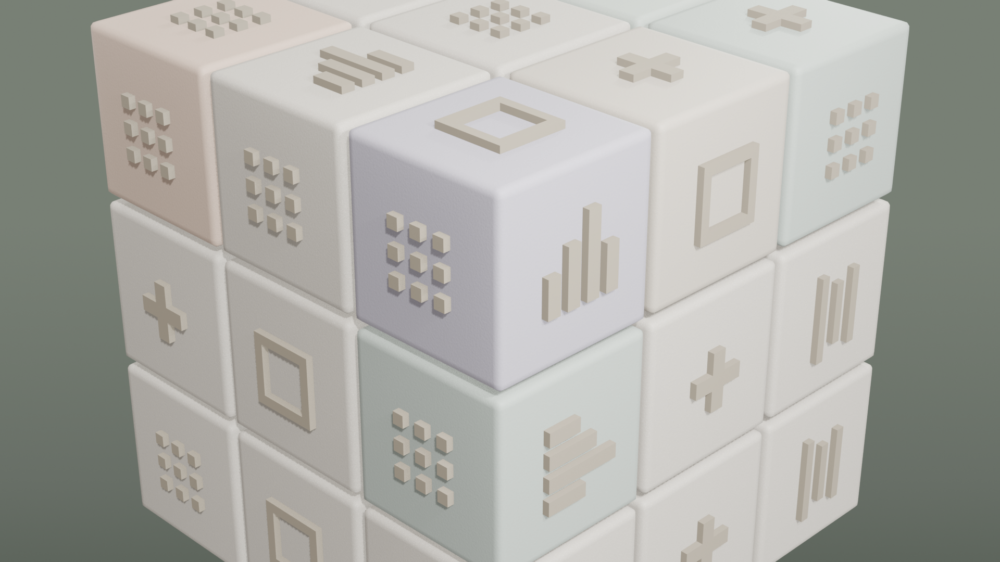

# Session 003 — 2026-05-01

## Goal
Polish v2 sobre el cubo de session 002. Cumplir los 3 puntos donde session 002
quedó corto contra D2C frame_010: edge color tints en cubies, iconos con
mayor contraste/profundidad, lighting con más drama.

## Starting point
- v04_animated.blend: cubo 27 piezas + 54 iconos + 28 animation tracks, todo cream uniform.
- Critique honesta de session 002: tints de color faltaban, iconos muy planos contra cubie,
  lighting suave sin specular drama.

## What was done

### Step A — Edge color tints (8 cubies)
1. Material `M_CubePiece_Cream` original conservado intacto.
2. Creados 6 materiales tinted clonando el original y reemplazando solo los stops del
   ColorRamp y el Mix RGBA:
   - `M_CubePiece_Sage_Cool` (`#C2CEC4`)
   - `M_CubePiece_Sage_Warm` (`#D8D0C0`)
   - `M_CubePiece_Peach_Soft` (`#E0C8B4`)
   - `M_CubePiece_Lavender` (`#C8C4D0`)
   - `M_CubePiece_Sage_Deep` (`#9CA89E`)
   - `M_CubePiece_Mint_Pale` (`#CCD8CC`)
3. Tints aplicados a 8 cubies VISIBLES desde la cámara (esquinas y edges del cuadrante
   front-right-top). Usado `material_slots[0].link = 'OBJECT'` para override per-instance
   sin romper la mesh data compartida del template.
4. Distribución: Cubie_002/022/202/222 (4 esquinas top), Cubie_021/102/201/212 (4 edges).
5. Speckle pattern y bump del material original preservados — solo cambia el tono base.

### Step B — Material dedicado para iconos
6. Creado `M_Icon_Cream`: cream warmer y más oscuro que el cubie cream.
   - Base color `#A89F8C` (vs cubie `#E8E4D8`)
   - Roughness 0.70, Specular IOR 0.30 (más mate)
7. Reasignado a los 54 iconos vía `material_slots[0].link = 'OBJECT'`.

### Step C — Drama lighting
8. Subidas intensidades:
   - Key: 350W → 700W (lateral más fuerte para sombras laterales en iconos)
   - Rim: 300W → 600W con tinte sage `(0.85, 0.92, 0.85)` para edge separation
   - Fill: 80W → 60W (menos relleno, más contraste)
9. Reposicionada Key a `(4.5, -1.5, 3.5)` — más lateral, sombras de iconos más visibles.
10. Reposicionada Rim a `(-1.0, 4.5, 3.5)` con tinte sage suave.
11. Agregada **AreaTop**: light area 4.0×4.0 a `(2.0, -1.5, 6.5)`, 350W warm white
    `(1.0, 0.97, 0.92)`, rotada 40°/15°. Soft top fill que da el "glow superior" típico
    de las refs D2C.

### Step D — Icons protrusion bump (más profundidad geométrica)
12. Re-construidas las 5 mesh data de iconos in-place con bmesh.
    - `ICON_PROTRUSION` 0.018 → **0.035** (casi el doble)
13. Approach: `bm.to_mesh(existing_mesh)` reemplaza vertices/faces conservando el datablock,
    todos los 54 objetos icon refrescan automáticamente porque comparten el mesh data.
14. Nota: el rebuild pierde edges/faces previas del bm pero como la mesh data está vacía
    en cada operación bmesh.from_mesh + clear, el resultado es limpio.

### Step E — Hero render + checkpoint + re-export
15. Render OpenGL 1920×1080 con MATERIAL preview (EEVEE).
16. Hero shot: `blender/refs/session_003_HERO_polished.png` (2.5 MB).
17. Checkpoint `v05_polished.blend` (1.4 MB) — más pesado que v04 por las 6 materiales nuevas.
18. **GLB re-exportado**: `kinetiba_cube_animated.glb` 133 KB (vs 127 KB anterior, +6 KB
    por los materiales tinted adicionales).
19. Copy a `public/models/kinetiba_cube_animated.glb`.
20. **28 animation tracks intactas** — el polish no tocó ninguna animación.

## Decisions taken
- **Tints sutiles, no chillones.** D2C nunca usa colores saturados — todos sage-adjacent
  con peach y lavender muy desaturados. Si te llegaste a preguntar si están ahí, es porque
  están bien calibrados.
- **Tints solo en cubies visibles.** Cubies internos del back/left no se ven desde la
  cámara hero — gastar tints ahí es desperdicio.
- **Material override via slot.link='OBJECT'** en lugar de unlink mesh data. Esto preserva
  la mesh sharing (mem-friendly) y permite override per-instance del material.
- **Subir protrusion antes que tocar shaders procedural.** La diferencia visual viene de
  geometría real con sombras, no de fake bumps.
- **AreaTop overhead** es lo que da el "glow premium" sutil de D2C. Sin ese light, el cubo
  se ve como product shot industrial; con él, se ve como editorial.

## Files touched
- `blender/_versions/kinetiba-hero-3d_v05_polished.blend` (1.4 MB)
- `blender/kinetiba-hero-3d.blend` (working file actualizado)
- `blender/exports/kinetiba_cube_animated.glb` (133 KB)
- `public/models/kinetiba_cube_animated.glb` (133 KB)
- `blender/refs/session_003_HERO_polished.png` (2.5 MB)

## Verification
- Hero render muestra los 8 tints sutilmente distinguibles entre los cubies cream.
- Iconos con sombras laterales claras, contraste warmer-darker contra cubies.
- AreaTop visible como specular highlight en faces superiores.
- Sage gradient bg sigue limpio.
- 28 animation tracks intactas en el GLB exportado.

## R3F integration
**El GLB nuevo es drop-in replacement.** Mismo nombre, mismas animation tracks, misma
estructura de jerarquía. El componente que carga `/models/kinetiba_cube_animated.glb`
no necesita cambios — solo refresh y los tints aparecen.

```jsx
// Sin cambios respecto a session 002
const { scene, animations } = useGLTF('/models/kinetiba_cube_animated.glb')
const { actions, mixer } = useAnimations(animations, group)
```

## Open issues / next sessions
1. **Validar visualmente en navegador.** Los tints pueden verse distinto bajo el lighting
   PMREM de R3F vs el viewport de Blender. Si quedan demasiado fuertes, próxima session
   bajamos saturación en los materiales clonados.
2. **Shadow catcher real solo aplica en Cycles full render.** En GLB exportado y en R3F
   live se ve el cubo flotante. Si quieres sombra debajo en el web hero, necesitas un
   `<ContactShadows>` de drei en el componente R3F (no es trabajo de Blender).
3. **Iconos semánticos por sección** (Session 004 candidata). Hot-swap de mesh data por
   posición de cubie vinculada a sección scroll: BI=ChartBars, WhatsApp=icono chat,
   ERP=icono invoice, CTA=icono bolt. Requiere modelar 3-4 nuevos tipos de icono.
4. **Morph_to_pill** para el final del scroll D2C. Shape keys o segundo mesh interpolado.
5. **Performance audit en mobile.** 28 animation tracks pueden tener costo. Si laggy,
   evaluar bake-down a single track con armature + bones (más complejo, menos overhead
   por mixer evaluation).

## Screenshots

### Hero polished (session 003)

