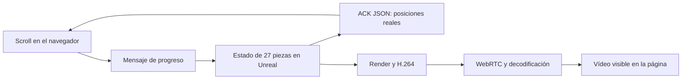

# Opciones de motores y autoría para Kineti

Revisión del 4 de septiembre de 2026, hora local. Las evidencias automáticas utilizan UTC y pueden llevar fecha del día 5. Este documento cubre opciones representativas y sus capas; no afirma haber probado todos los motores, bibliotecas, forks y servicios existentes.

**Unreal sí tiene una prueba web real en este equipo:** [abrir el prototipo local](http://127.0.0.1:8899), [código aislado](../research-engines/unreal/README.md), [informe de ejecución](../research-engines/unreal/evidence/qa-report.json). El navegador recibe vídeo H.264 de Unreal Engine 5.7.4 mediante PixelStreaming2. El progreso y las piezas se controlan desde JavaScript y el motor confirma sus coordenadas por un canal de datos. Unity y Godot quedaron documentados, con la prueba práctica pendiente por falta de instalación.

## Qué está disponible de verdad

| Opción | Evidencia local | Estado de esta revisión |
| --- | --- | --- |
| Unreal Engine 5.7.4 | `C:\Program Files\Epic Games\UE_5.7\Engine\Build\Build.version`; plugins PixelStreaming y PixelStreaming2; VS Build Tools 2022 y SDK Windows disponibles | **Compilado y ejecutado.** Nuevo proyecto `research-engines/unreal`, PixelStreaming2 activo, vídeo/control comprobados en Chrome |
| Blender 5.1.2 | `C:\Program Files\Blender Foundation\Blender 5.1\blender.exe`; versión comprobada con ejecución en segundo plano | Autoría disponible. No se ha contado como motor web ni como otra prueba de render interactivo |
| Unity / Unity Hub | No detectados en PATH, registro, Program Files, programas locales, Apps, Steam o ubicaciones de proyectos/descargas inspeccionadas | **Pendiente.** No hay editor ni módulo Web Build Support detectado con el que generar una exportación local |
| Godot | No se encontró ejecutable portable, proyecto o instalación en las ubicaciones inspeccionadas; tampoco directorio habitual de plantillas web en AppData/Roaming/Godot | **Pendiente.** Faltan ejecutable/editor y plantilla de exportación web compatibles |
| Spline | No se ha verificado una escena Kineti exportada, sesión de editor ni acceso al archivo de escena | **Documentado.** No hay ejecución A/B de Spline en esta revisión |

La búsqueda incluyó `C:\Apps`, ambas carpetas Program Files, registro de desinstalación HKLM/HKCU, PATH, Desktop, Downloads, Documents, AppData/Local/Programs, AppData/Local y Steam/common. La ausencia significa «no detectado en este inventario», no una búsqueda exhaustiva de todos los volúmenes/usuarios. No se instalaron Unity, Godot, SDKs de varios GB ni servicios externos.

El proyecto previo `C:\Users\fsala\Documents\Unreal Projects\MountainsUE` solo se inspeccionó a nivel de directorio. No se modificaron sus contenidos ni se utilizaron sus assets. La escena nueva usa únicamente geometría/material básico del engine. Los scripts de parada comprueban la ruta de la línea de comandos antes de detener exclusivamente los PID registrados por este prototipo.

## Dos formas distintas de llegar al navegador

| Arquitectura | Dónde se ejecutan escena, shaders y efectos | Camino de un cambio de scroll | Consecuencia para visitantes independientes |
| --- | --- | --- | --- |
| Runtime en el navegador: Three, Babylon, PlayCanvas, API directa, Unity Web, Godot Web, Spline runtime | CPU/GPU de cada visitante, dentro de las APIs y límites del navegador | DOM → estado del runtime → render local | Cada visita puede mantener su propio progreso; se distribuyen archivos de aplicación/assets |
| Unreal Pixel Streaming | Proceso nativo de Unreal en una máquina con GPU; el navegador decodifica vídeo | DOM → WebRTC → estado de Unreal → render → codificación → red → decodificación → presentación | Compartir un proceso comparte su escena/cámara; progreso independiente requiere separar estado/render/sesiones mediante una arquitectura adicional |

Epic documenta Pixel Streaming como render remoto transmitido mediante WebRTC, con entrada de ratón, teclado, táctil y eventos personalizados de la página. El prototipo ejecuta ambas partes en el mismo PC; demuestra el mecanismo remoto, no las condiciones de una conexión por Internet. [Epic: Pixel Streaming](https://dev.epicgames.com/documentation/en-us/unreal-engine/pixel-streaming-in-unreal-engine).

Para redes distintas, Epic describe negociación NAT mediante STUN/TURN y despliegues con distintas instancias. Es una tarea operativa adicional a servir HTML estático. Aquí no se configuraron STUN/TURN, nube, autenticación ni sesiones por visitante. [Epic: alojamiento y redes](https://dev.epicgames.com/documentation/en-us/unreal-engine/hosting-and-networking-guide-for-pixel-streaming-in-unreal-engine).

El ACK y el vídeo son caminos separados. Recibir coordenadas confirma que el motor aplicó un valor; no acredita que ese fotograma ya esté en pantalla. Medir la latencia visual exige identificar el estado dentro del vídeo o una prueba de captura sincronizada.

## Alcance comprobado de Unreal

El proyecto C++ arranca como juego mediante `UnrealEditor-Cmd.exe -game -RenderOffscreen`, con los binarios instalados del editor. **No es un paquete de distribución Windows ni un export HTML5/WASM.** El plugin ejecutado es PixelStreaming2; sus argumentos de CLI conservan el prefijo `-PixelStreaming...`, según el parser de UE 5.7.4.

La señalización es un fixture mínimo propio, limitado a `127.0.0.1:8898` y `127.0.0.1:8899`, que implementa los mensajes documentados por Epic. Usa `ws`, ya presente en las dependencias del proyecto. No es una copia completa de Wilbur, el servidor de referencia oficial. La ruta de datos y codificación la implementa el plugin oficial instalado. [Protocolo de señalización UE5.7](https://github.com/EpicGames/PixelStreamingInfrastructure/blob/UE5.7/Common/docs/messages.md), [servidor de referencia](https://github.com/EpicGames/PixelStreamingInfrastructure/blob/UE5.7/SignallingWebServer/README.md).

Las 12 comprobaciones de `qa.mjs` cubren: vídeo decodificado con contenido, 27 piezas confirmadas por Unreal, desplazamiento exclusivo de una pieza y cambio visible, separación, transformación intermedia/final, scroll DOM → estado del motor, recorrido continuo de scroll hacia delante/atrás, restauración de posiciones y píxeles con tolerancia a compresión, cambio de cámara y estadísticas WebRTC. Se guardan capturas de las etapas y los ACK recibidos.

La escena usa 27 cubos, suelo y dos luces. No incorpora los mismos bevels, glifos, HDR, materiales, densidad o coreografía de los prototipos web principales. **No permite puntuar belleza o rendimiento como una comparación de escenas equivalentes.** Los fps del vídeo recibido sirven para comprobar transporte activo, no para comparar potencia de motores. Había otros trabajos en la GPU.

Los materiales HLSL personalizados y pases de postproceso son capacidades documentadas de Unreal; no se han implementado ni medido en este fixture. Tampoco se probaron feedback temporal propio, Lumen, Nanite, path tracing o escalado de sesiones. [Expresiones HLSL](https://dev.epicgames.com/documentation/en-us/unreal-engine/custom-material-expressions-in-unreal-engine), [materiales de postproceso](https://dev.epicgames.com/documentation/en-us/unreal-engine/post-process-materials-in-unreal-engine).

## Unity y Godot: exportación real posible, prueba local pendiente

**Unity Web:** en el manual verificado de Unity 6.3 LTS, WebGL2 sigue siendo la API web predeterminada y WebGPU está etiquetada como experimental. Se ejecutan en el navegador. La documentación WebGPU enumera compute shaders, indirect rendering, GPU skinning y VFX Graph; también limita, entre otras cosas, async compute, resolución dinámica y arrays de cubemaps. Estas son capacidades documentadas de ese exportador, no resultados ejecutados aquí. [Unity WebGL2](https://docs.unity3d.com/6000.3/Documentation/Manual/WebGL2.html), [estado WebGPU](https://docs.unity3d.com/6000.3/Documentation/Manual/WebGPU.html), [funciones WebGPU](https://docs.unity3d.com/6000.3/Documentation/Manual/WebGPU-features.html).

Unity admite comunicación entre JavaScript y C#/C/C++, por lo que un progreso DOM → método del juego es una integración documentada. La prueba que falta es construir la escena y comprobar ese puente, sus shaders/pases, carga y compatibilidad en un build Web específico. No se extrapolan las capacidades del editor de escritorio al navegador. [Unity: interacción con JavaScript](https://docs.unity3d.com/6000.3/Documentation/Manual/webgl-interactingwithbrowserscripting.html).

**Godot 4 Web:** la documentación estable consultada requiere WebAssembly y WebGL2, usando Compatibility; Forward+/Mobile y WebGPU no están disponibles para ese destino. El export web monohilo está soportado desde 4.3. Las exportaciones con hilos requieren aislamiento de origen/cabeceras; los proyectos C# de Godot 4 siguen sin export web en la página verificada. No debe presentarse una escena Forward+ de escritorio como lo que recibirá el navegador. [Godot: exportar a web](https://docs.godotengine.org/en/stable/tutorials/export/exporting_for_web.html).

El puente JavaScriptBridge permite conectar la página con Godot. Hay shaders que leen la pantalla, con reglas concretas de copia de buffers; «feedback» requiere diseñar y comprobar recursos y secuencia de pases, no marcar una casilla. Faltan ejecutable y plantillas locales para probarlo. [JavaScriptBridge](https://docs.godotengine.org/en/stable/tutorials/platform/web/javascript_bridge.html), [lectura de pantalla](https://docs.godotengine.org/en/stable/tutorials/shaders/screen-reading_shaders.html), [plantillas de exportación](https://docs.godotengine.org/en/stable/tutorials/export/exporting_projects.html).

## Bibliotecas de otra capa y herramientas de autoría

| Opción | Capa real | Cómo encaja en esta decisión |
| --- | --- | --- |
| React Three Fiber / Drei | Integración React y utilidades sobre Three | Cambian la manera de construir/controlar la escena. R3F no añade otro backend 3D independiente. [Repositorio R3F](https://github.com/pmndrs/react-three-fiber) |
| GSAP / ScrollTrigger | Interpolación y coordinación con scroll | Pueden alimentar progreso, cámaras y propiedades de distintos motores. Comparar GSAP contra Three como renderers confunde responsabilidades. [ScrollTrigger](https://gsap.com/docs/v3/Plugins/ScrollTrigger/) |
| PixiJS | Renderer 2D con WebGL/WebGPU | Candidato para glifos, partículas 2D y overlays. Su propia documentación propone combinarlo con Three para escenas 3D. No equivale directamente al pipeline PBR de 27 volúmenes. [Pixi 8](https://pixijs.com/8.x/guides/getting-started/intro), [Three + Pixi](https://pixijs.com/8.x/guides/third-party/mixing-three-and-pixi) |
| Rive | Autoría, estados y reproducción de gráficos vectoriales | Útil para interfaz y animación 2D interactiva. La integración Unity describe Rive como contenido 2D que puede convertirse en textura de una escena 3D. No se ha validado como sustituto de la geometría/PBR del cubo. [Rive Renderer](https://rive.app/renderer), [componentes Unity](https://rive.app/docs/game-runtimes/unity/components) |
| Spline | Editor visual + runtime 3D y API web | Es candidato 3D real para un flujo de autoría visual. La documentación actual indica WebGPU predeterminado con fallback WebGL; su API controla variables, propiedades y eventos. No se probó una escena propia ni control de pases arbitrarios/feedback. [Exportar código](https://docs.spline.design/exporting-your-scene/web/exporting-as-code), [Code API](https://docs.spline.design/exporting-your-scene/web/code-api-for-web) |
| Blender | Autoría y render offline | Puede producir bevels, normales, UV, glifos, animación y materiales exportables para distintos runtimes. glTF transporta datos/materiales reconocidos por el exportador; no entrega el renderer Cycles/Eevee al navegador. [Manual glTF Blender 5.1](https://docs.blender.org/manual/ru/5.1/addons/import_export/scene_gltf2.html) |

Spline permite exportar varias integraciones, pero su documentación distingue qué formatos conservan animaciones/eventos. Se necesita probar la exportación elegida y su API concreta antes de atribuirle todo el control de WebGPU directo. Un paquete npm de reproducción por sí solo no demuestra que podamos autorizar, exportar y mantener una escena nueva desde esta sesión. [Spline: exportación](https://docs.spline.design/exporting-your-scene/web/exporting-as-code).

Para aumentar el acabado del cubo, Blender puede mejorar los assets compartidos independientemente del motor. El siguiente paso comparable sería usar exactamente esos assets, cámaras, entorno, resolución y etapas de progreso en cada runtime. Un motor con muchas funciones no produce automáticamente un mejor resultado visual sin ese trabajo de materiales, iluminación y composición.

## Qué decisión respalda esta evidencia

Para un hero con scroll independiente por visitante, esta revisión mantiene los runtimes ejecutados en navegador como candidatos principales de la comparación. Unreal queda añadido como **alternativa realmente ejecutada de render remoto**, especialmente pertinente si el requisito exige una escena nativa compleja y se acepta operar su infraestructura. Esta es una inferencia arquitectónica para Kineti; no una clasificación de calidad gráfica absoluta.

Unity, Godot y Spline no reciben una puntuación experimental en este documento. Su siguiente prueba debe ser una exportación web observable de una escena equivalente, con controles, errores, carga, píxeles y límites registrados. Para Unreal siguen pendientes el paquete distribuible, una escena visualmente equivalente, input-to-pixel, clientes con progreso independiente, redes reales y dispositivos móviles. Otras familias especializadas —visualización geoespacial, CAD, mapas, vídeo prerenderizado o frameworks de bajo nivel adicionales— requerirían su propia pregunta concreta; no están cubiertas por afirmar «todas las opciones».
